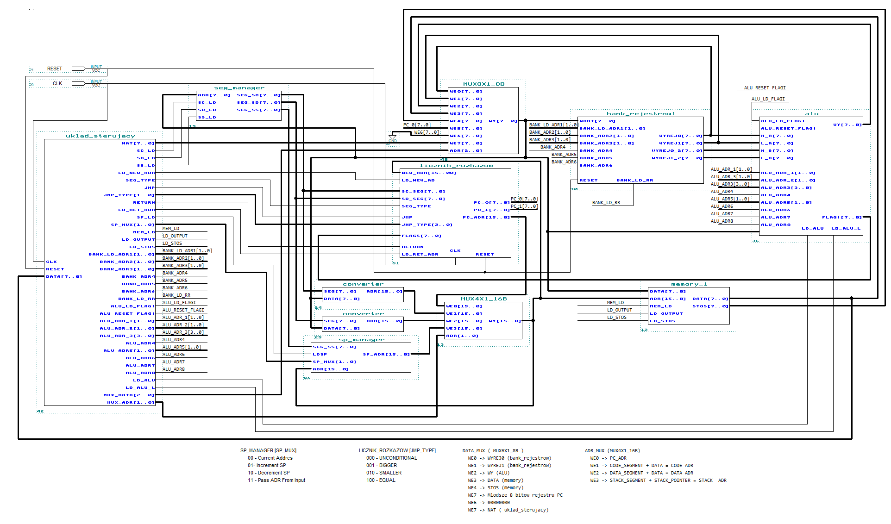
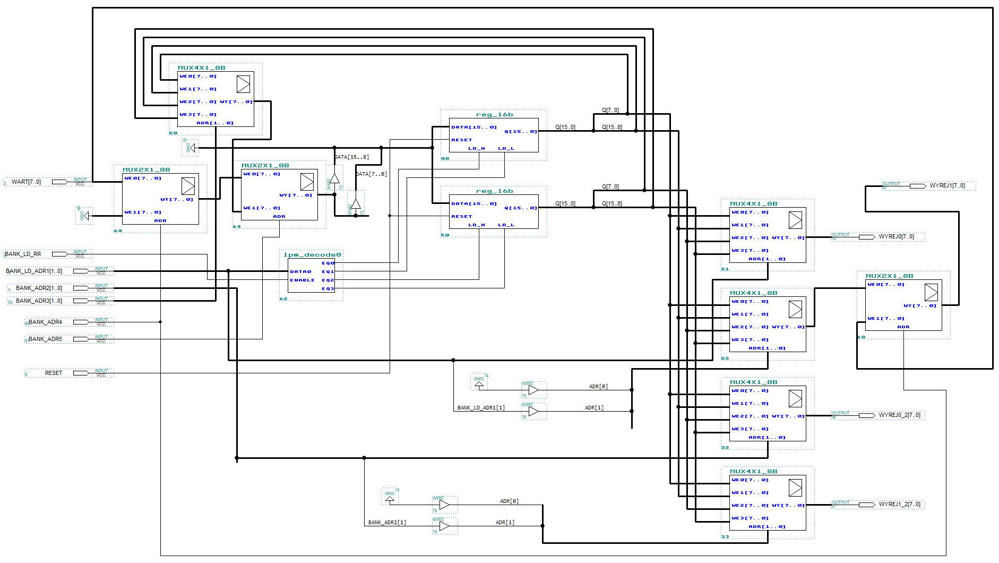
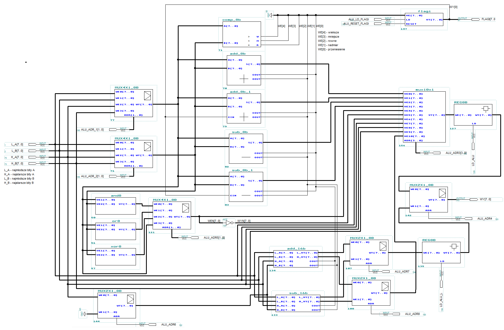

# Projekt mikroprocesora
Celem projektu było stworzenie schematu mikroprocesora o podanych poniżej wymaganych funkcjonalnościach.

# Wymagania mikroprocesora
1. Możliwość zaadresowania 4096 słów pamięci operacyjnej.
2. Wspieranie adresowania:
   1. Domyślne,
   2. Natychmiastowe,
   3. Bezpośrednie.
3. Wspieranie segmentacji pamięci z podziałem na segment kodu programu i segment danych.
4. Posiadanie odpowiedniej liczby rejestrów segmentowych.
5. Posiadanie rejestru licznika rozkazów (tylko do odczytu).
6. Posiadanie 2 rejestrów uniwersalnych 16-bitowych z możliwością adresowania części starszej i młodszej rejestru.
7. Obsługa stosu.
8. Posiadanie wydzielonego bloku ALU.
9. Wykonywanie rozkazów:
   1. Przesyłanie danych rej-nat, rej-rej, rej-pam,
   2. Dodawanie/odejmowanie rej-nat, rej-rej, rej-pam,
   3. Dodawanie/odejmowanie 16-bitowe rej-nat, rej-rej,
   4. Porównywanie rej-rej, rej-nat, rej-pam,
   5. Wywołanie podprogramu,
   6. Wykonywanie skoku bezwarunkowego do adresu podanego jako liczba lub rejestr,
   7. Wykonywanie skoków warunkowych gdy większe, mniejsze, równe,
   8. Wyliczanie wartości funkcji logicznych dla rej-rej, rej-pam.
# Uruchomienie projektu
Aby uruchomić poszczególne schematy mikroprocesora należy skorzystać z oprogramowania typu MAX+PLUS II, Quartus Prime i odczytać odpowiedni plik *.gdf
https://www.intel.com/content/www/us/en/collections/products/fpga/software/downloads.html?edition=lite&platform=windows

# Dokumentacja
Pełna dokumentacja projektu znajduje się w pliku Dokumentacja_Projektu.pdf.

# Schemat główny MikroProcesora:

# Schemat modułu banku rejestrów:

# Schemad modułu ALU:

